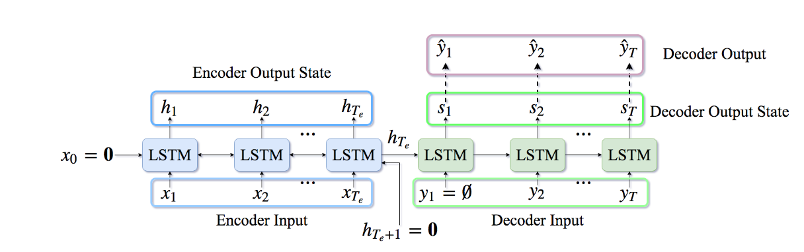

********************
Easy-TensorFlow
********************

.. image:: https://img.shields.io/badge/contributions-welcome-brightgreen.svg?style=flat
    :target: https://github.com/yaserkl/RLSeq2Seq/pulls
.. image:: https://img.shields.io/badge/Made%20with-Python-1f425f.svg
      :target: https://www.python.org/
.. image:: https://img.shields.io/pypi/l/ansicolortags.svg
      :target: https://github.com/yaserkl/RLSeq2Seq/blob/master/LICENSE.txt
.. image:: https://img.shields.io/github/contributors/Naereen/StrapDown.js.svg
      :target: https://github.com/yaserkl/RLSeq2Seq/graphs/contributors
.. image:: https://img.shields.io/github/issues/Naereen/StrapDown.js.svg
      :target: https://github.com/yaserkl/RLSeq2Seq/issues

The goal of this repository is ...

#################
Table of Contents
#################
.. contents::
  :local:
  :depth: 3

..  Chapter 1 Title
..  ===============

..  Section 1.1 Title
..  -----------------

..  Subsection 1.1.1 Title
..  ~~~~~~~~~~~~~~~~~~~~~~

============
Motivation
============

In recent years, text summarization moved from traditional bag of word models to more
advanced methods based on Recurrent Neural Networks (RNN). The underlying framework of all these models are usually a deep neural network which contains an encoder
module and a decoder module. The encoder processes the input data and a decoder receive the output of the encoder and gener-
ates the final output. Although simply using an encoder/decoder framework would, most
of the time, produce better results than traditional methods on text summarization, researchers proposed additional improvements over these models by using attention-based
models, pointer-generation models, and self-attention models. However, all these models
suffer from a common problem known as exposure bias. In this work, we first study various solutions suggested for avoiding exposure
bias and show how these solutions perform on abstractive text summarization and finally propose our solution, SoftE2E, that reaches state-
of-the-art result on CNN/Daily Mail dataset.

---------------------------------------------------------------------------

============
DATASET
============
----------------------
CNN/Daily Mail dataset
----------------------
https://github.com/abisee/cnn-dailymail

----------------------
Newsroom dataset
----------------------
https://summari.es/

We have provided helper codes to download the cnn-dailymail dataset and
pre-process this dataset and newsroom dataset.
Please refer to this link to access them:

We saw a large improvement on the ROUGE measure by using our processed version of these datasets
in the summarization results, therefore, we strongly suggest to use these pre-processed files for
all the trainings.

---------------------------------------------------------------------------

====================
Code Implementation
====================

-----------------
Dependencies
-----------------

~~~~~~~~~~~~~~~~~~~
Python
~~~~~~~~~~~~~~~~~~~

Python requirements can be installed as follows:

.. code:: bash

    pip install -r python_requirements.txt

~~~~~~~~~~~~~~~~~~~
TensorFlow
~~~~~~~~~~~~~~~~~~~

  - Version?

~~~~~~~~~~~~~~~~~~~
GPU
~~~~~~~~~~~~~~~~~~~

  - Cuda version?
  - Cudnn?

-----------------
Training
-----------------

-----------------
Evaluation
-----------------

~~~~~~~~~~~~~~~~~~~
Evaluation metrics
~~~~~~~~~~~~~~~~~~~

---------------------------------------------------------------------------

===============
Citation
===============

---------------------------------------------------------------------------

===============
Aknowledgement
===============
